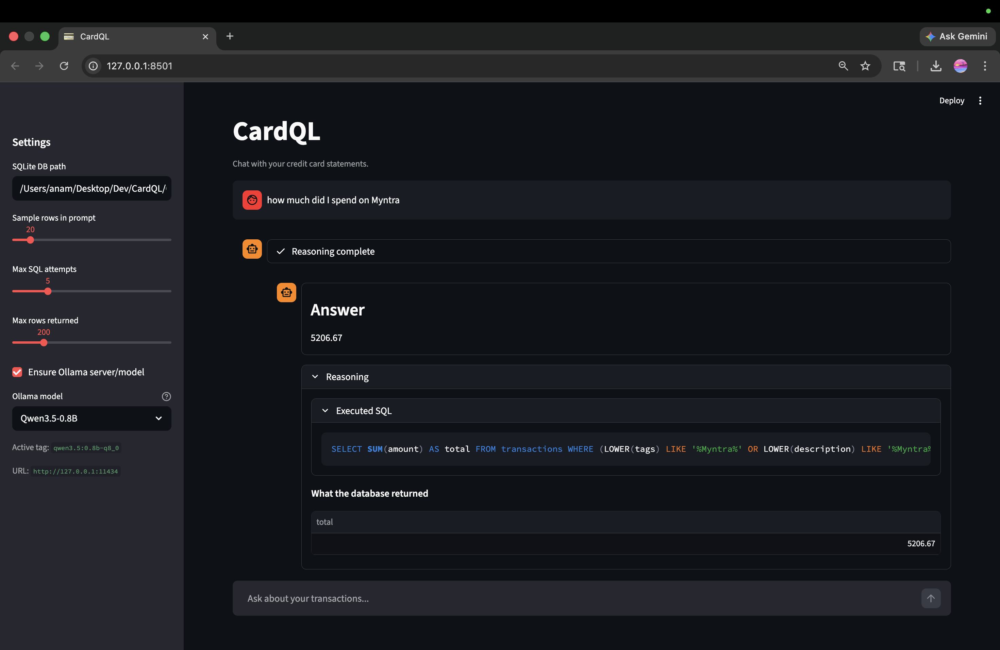

# CardQL

**Chat with your credit card statements!**

CardQL pulls credit card statement PDFs from your **email** (via **IMAP**), turns them into a single **CSV** and **SQLite** database, then runs a **local** text-to-SQL loop: small **Qwen** models through **Ollama**, with a **Streamlit** chat UI. No cloud API is required for parsing or querying.

---

## What it does (three parts)

1. **Fetch** — Connect to your mailbox over **IMAP**, match sender rules, download password-protected PDFs into `data/raw-pdfs/<bank>/<card>/`.
2. **Parse and export** — Extract text, run **bank-specific parsers** (regex and layout heuristics), normalize rows, merge to **`data/exports/master.csv`** and **`transactions.sqlite`**.
3. **Query** — **Natural language → SQL** with validation, **LangChain** + **Ollama**, answers grounded on query results; or open a raw **`sqlite3`** shell with **`cardql sql`**.

Real-world data work shows up everywhere: shaky **email** subjects and attachments, **PDF** engines that reflow tables differently per issuer, **one-shot prompting** for tiny models (tight JSON/SQL, retries), and **SQL verification** so you are not trusting free-form arithmetic from the LLM.

This runs inference locally with **Qwen3.5-0.8B**, **Qwen3.5-4B**, or **Qwen3-Coder-30B** (via **Ollama**) — models you can run completely on a laptop. I recommend the **Qwen3.5-4B** preset for balanced performance.

---

## Stack

`Python` · `pypdf` · `SQLite` · `LangChain` · `Ollama` · `Streamlit` · local-first / on-device inference

### Streamlit UI



---

## Quick start

Install (from the repo root):

```bash
python3 -m venv .venv
source .venv/bin/activate   # Windows: .venv\Scripts\activate
pip install -r requirements.txt
pip install .                 # installs `cardql` on PATH (same as pip3 install .)
```

After install, **`cardql`** behaves like other console tools (`streamlit`, `jupyter`) for that environment.

**One shot** — create dirs and templates, fetch (if rules exist), normalize, export CSV + SQLite, open the CSV, ensure **Ollama**, launch **Streamlit**:

```bash
# Edit .local/config/secrets.json and .local/config/card_rules.json first
cardql
```

Flags on the default command: `--force`, `-o` (master CSV path), `--no-open`, `--no-fetch`, `--skip-ollama`, `--no-ui`.

Without `pip install .`, **`./run`** uses `python -m cardql` and prefers `.venv` if present.

For a slower walkthrough, see [docs/USER_GUIDE.md](docs/USER_GUIDE.md).

---

## Commands

| Command | What it does |
|--------|----------------|
| `cardql` | **Full stack:** init, optional IMAP fetch, normalize, **master.csv** + **transactions.sqlite**, open CSV, **Ollama**, **Streamlit**. |
| `cardql init` | Create `.local/` and `data/`, write config templates (**never overwrites** existing files). |
| `cardql fetch` | Fetch new statement PDFs via **IMAP** into `data/raw-pdfs/`. |
| `cardql parse` | Normalize PDFs, merge to **master.csv** + SQLite, open CSV (`--no-open` to skip). Optional single PDF; with `-o out.json` writes JSON only for that file. |
| `cardql ollama` | Ensure Ollama is reachable and pull the default chat model. |
| `cardql ui` | Streamlit NL chat over **`transactions.sqlite`**. |
| `cardql sql` | Interactive **`sqlite3`** on the transactions DB (default `data/exports/transactions.sqlite`). |
| `cardql check` | Run validation checks (month gaps between statements; more later). `cardql check --gaps` narrows to the gap check. |

**Logging:** `CARDQL_LOG=DEBUG cardql` for verbose output.

**Environment:** variables use the **`CARDQL_`** prefix (e.g. `CARDQL_OLLAMA_MODEL`, `CARDQL_OLLAMA_BASE_URL`).

---

## Documentation

| Doc | Why open it |
|-----|-------------|
| [docs/ARCHITECTURE.md](docs/ARCHITECTURE.md) | Pipeline, folders, bare `cardql` steps. |
| [docs/LLM_QUERY.md](docs/LLM_QUERY.md) | NL→SQL, retries, Qwen/Ollama, safety. |
| [docs/PDF_PARSING.md](docs/PDF_PARSING.md) | How parsers work; adding a bank or variant. |
| [docs/CONFIG.md](docs/CONFIG.md) | `card_rules.json`, tags, optional `app.json`. |
| [docs/IMAP_SETUP.md](docs/IMAP_SETUP.md) | Mailbox credentials and provider notes. |
| [docs/USER_GUIDE.md](docs/USER_GUIDE.md) | Short non-developer path. |

---

## Email (IMAP)

CardQL fetches attachments over **IMAP** and tracks state under `.local/state/`. Host, folder, and credentials live in **`.local/config/`** — see [docs/IMAP_SETUP.md](docs/IMAP_SETUP.md) for provider-specific setup (app passwords, etc.).

---

## Banks and cards

Configure **`.local/config/card_rules.json`** — one block per bank/card:

- **`bank`**, **`card`** — under `data/raw-pdfs/<bank>/<card>/`
- **`from_emails`** — sender addresses to match
- **`passwords`** — PDF passwords

Details: [docs/CONFIG.md](docs/CONFIG.md).

---

## Parsers

Parsers live in `src/cardql/parsers/banks/`. Supported issuers today include **Axis**, **HDFC**, **HSBC**, **ICICI**, **IndusInd**, **SBI**. Adding another card or fixing a format: [docs/PDF_PARSING.md](docs/PDF_PARSING.md).

---

## Help improve CardQL

If your issuer bank is not covered or a statement layout breaks, a focused parser patch helps everyone. **Open a pull request** with a parser or tests against redacted samples, or **open an issue** to coordinate with the maintainers. Convention details live in [CONTRIBUTING.md](CONTRIBUTING.md).

---

## Security and privacy

Your statements and spend history are sensitive. CardQL keeps **parsing and inference on your machine**: PDFs and **`transactions.sqlite`** stay local; the NL path uses a **small local model** via Ollama so you are not uploading statement bytes to a third-party chat API. That is a different tradeoff than “send PDFs to a hosted LLM or document AI” — fewer moving parts, and no vendor fine-tuning on your data.

**`.local/`** and **`data/`** are gitignored by design. Do not commit credentials, PDFs, or databases.

---

## Project layout

- **`data/raw-pdfs/<bank>/<card>/`** — downloaded PDFs  
- **`data/normalized/<bank>/<card>/`** — per-statement JSON  
- **`data/exports/master.csv`**, **`transactions.sqlite`** — merged data for CSV tools and SQL  
- **`.local/config/`** — secrets and rules  
- **`src/cardql/`** — **`ingest/`**, **`parsers/`**, **`export/`**, **`query/`**, **`ui/`**, **`cli/`**

Architecture: [docs/ARCHITECTURE.md](docs/ARCHITECTURE.md) · Contributing: [CONTRIBUTING.md](CONTRIBUTING.md)
